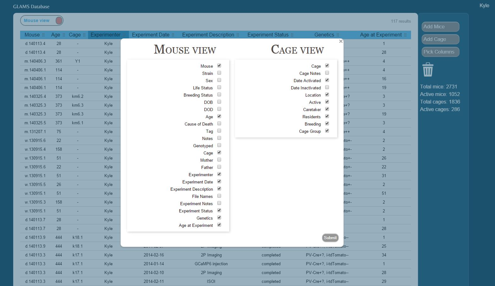

Glams
=====

:Title:    
    Glams - A browser based animal management system

:Author:       
    Kyle Ellefsen

:Date:
    2015.06.04

:Description:  
    Glams is a browser based animal management system, designed for managing mice colonies in a university research settings.  Rather than keeping track of breeding, genotyping, planned and completed experiments in a spreadsheet, Glams enables researches to store all this information in a MySQL database and manipulate it in your browser.

Glams is organized into two 'views': Mouse view and Cage view.  You can choose which categories are displayed in each view.  

INSTALLATION FOR WINDOWS
========================

#. Install MySQL (for `windows <http://dev.mysql.com/downloads/windows/installer/>`_.)

   - Install the Developer version.
   - Choose ``Sever Machine`` when prompted for 'server configuration type'.
   - Choose ``Enable TCP/IP Networking`` if you would like to access Glams from other computers.
   - Leave the port number as the default ``3306``. 
   - Keep ``Open firewall port for network access`` checked.
   - Use your lab password as the ``MySQL Root Password``.
   - Add a user.  
   - Set 'host' to be ``<All Hosts (%)>``. 
   - Set 'Role' as ``DB Admin``.  
   - Leave authentication as ``MySQL``.  This user account will be in Glams to communicate with MySQL, and it will be saved as plaintext, so make sure it is a password you don't use for anything else. Remember it for a later step.
   - Run Windows Service as a Standard System Account. This automatically starts MySQL on Windows startup.
#. Install Glams using the `installer <https://db.tt/pKfWCj4V>`_.
#. Run Glams by clicking the new icon on your desktop.
#. Open a browser, go to http://localhost/, enter the user and password. 
#. Restart Glams and refresh your browser.
#. Login as admin (password is 'password') and create a user. Sign out and sign in as that user.

INSTALLATION FOR LINUX AND MAC OSX
==================================
I have not tested installation on these systems.

#. Install and run MySQL
#. Install the latest version of Python 2 (`2.7.6 <http://www.python.org/getit/releases/2.7.6/>`_. as of 2013.12.17) 
#. Install pip (instructions at `pip-installer.org <http://www.pip-installer.org/en/latest/installing.html>`_.)
#. Install `lxml <https://pypi.python.org/pypi/lxml/2.3>`_.
#. Install Glams. In a command line, change directory to where pip.py is installed. Then type::

    pip install glams

#. In a command line, change directory to where Glams is installed. Launch the Glams server by running::

    main.py

   in the Glams directory.  
#. Open a browser, go to http://localhost/, enter the user and password. 
#. Restart Glams and refresh your browser.
#. Login as admin (password is 'password') and create a user. Sign out and sign in as that user.

INSTRUCTIONS FOR Glams INTERFACE
================================

Also included in Glams is a package called glamsinterface.  This allows you to interact with the data stored on Glams outside of the web browser.  For instance, if you have animals associated in Glams with experiments, you can find all of the experiments done on a particular strain or on animals of a particular age.  You can set up another database with the data for those experiments and link the two databases.  This could help automate data analysis, allowing researchers to spend more time designing experiments and less time rearranging spreadsheet values.
   
TODO
=====
- Add full calendar functionality
- Save the column order when a user moves a column.
- add 'date audited' to each cage.  Create a button a user can push to confirm cage information.
- Add column with 'Days Since Possible Mating' in cage view.  If any mature male mice entered a cage with mature female mice, count down 21 days
- Add column "Days Since Birth" in cage view.

BUGS
====
- If viewing on the chrome web browser which has the google docs app installed, you can't view mouse or cage information.  This might be a chrome bug.
- Sometimes creates two 'housing' entries when dragging mouse from one cage to another. Very hard to replicate bug.

